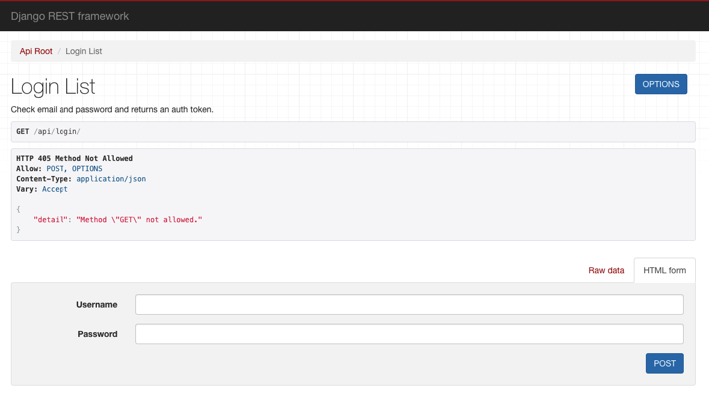
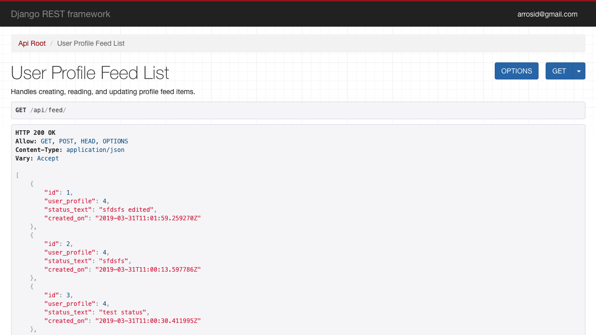

# profile-project-drf
Django Rest Framework Profile Project Source Code

In this project, we have some functional API.

We can get, add, edit, or delete users

We can login to the application, without login to the application, we can't see or create a feed post

We can get, add, edit, or delete feed post

